<!--
/**
 * Purpose: Product-level documentation for the Targeted Domain Crawler feature.
 * Description: Explains purpose, architecture, modules, data flow, setup, CLI,
 *              config, outputs, and troubleshooting for the implementation in
 *              `crawler/`. Serves as the definitive reference for this feature.
 * Key Sections: Overview; Architecture; Modules; CLI & Config; Outputs; Dev Status;
 *               Usage Examples; Troubleshooting; Quick Reference
 * AIDEV-NOTE: Keep this document in sync with edits to files under `crawler/*`.
 */
-->

## Feature Overview

The Targeted Domain Crawler discovers and extracts structured content from company websites with a focus on service-related pages (e.g., fire protection). It prioritizes high-value internal links using deterministic rules, normalizes page content, and emits:

- A full, machine-readable JSONL (`raw-output.jsonl`)
- A filtered LLM-ready JSONL (`llm-input.jsonl`)
- A human-friendly Markdown summary (`raw-output.md`)

- **Business value**: Rapid enrichment of target accounts with verified website content and key signals (headings, keywords, evidence). Supports batch processing, resumability, politeness, and robots respect.
- **Problems solved**:
  - Canonical domain resolution and robots preflight
  - Deterministic, service-oriented link selection with optional scoring
  - Lightweight, consistent page normalization and reporting
- **Target users**: Data/research ops, growth, and engineering teams orchestrating content discovery across large domain sets.

```mermaid
flowchart LR
  CSV[Input CSV] --> Reach[reachability.load_domains_from_csv]
  Reach --> Canon[canonical.canonicalize_domain]
  Canon -->|preflight| Robots[canonical.is_robot_disallowed]
  Robots -->|ok| HomeCrawl[AsyncWebCrawler homepage]
  HomeCrawl --> Links[link_selection.extract_anchors_from_html]
  HomeCrawl --> LinksRaw[(result.links.internal)]
  Links & LinksRaw --> Select[select_links_simple]
  Select --> SubpageCrawl[AsyncWebCrawler subpages]
  SubpageCrawl --> Extract[extraction.make_page_record]
  Extract --> RawJSONL[raw-output.jsonl]
  Extract --> LLMJSONL[llm-input.jsonl]
  RawJSONL --> Report[raw-output.md]
```



## Architecture and Application Structure

- Entrypoint: `crawler/run_crawl.py`
- Core modules in `crawler/`:
  - `canonical.py`: canonical URL resolution and robots preflight
  - `checkpoint.py`: file-based idempotent progress tracking
  - `extraction.py`: markdown normalization, headings/keywords, evidence
  - `link_selection.py`: internal link discovery and deterministic selection
  - `logging.py`: structured JSON-line logging helpers
  - `output_writer.py`: atomic JSONL writer utilities
  - `politeness.py`: delays, jitter, and backoff sequences
  - `reachability.py`: CSV domain loading and normalization
  - `report_md.py`: Markdown report generator for run outputs (`raw-output.md`)
  - `session.py`: stable session IDs and browser headers
  - `config.json`: runtime config for selection, limits, and behavior
- Tests: `crawler/tests/` covering selection, extraction, IO, reachability

High-level orchestration:

- CLI → load config/CSV → for each domain: canonicalize → robots preflight → crawl homepage (Crawl4AI) → select links → crawl subpages → extract/normalize → write JSONL → generate Markdown report.

## Functionalities

- **Domain intake**: `reachability.load_domains_from_csv` normalizes apex domains, preserving input order and uniqueness.
- **Canonical probing**: `canonical.canonicalize_domain` tries https/www/http fallbacks; `canonical.is_robot_disallowed` provides a conservative preflight check.
- **Crawl execution**: `run_crawl.main` uses Crawl4AI `AsyncWebCrawler` with Playwright-backed rendering, pruning content filter, and optional link preview scoring.
- **Link selection**:
  - Extracts DOM anchors via `link_selection.extract_anchors_from_html` with internal-only filtering and disallowed path drops.
  - Deterministic selection via `select_links_simple` (current default), with optional intrinsic/contextual scoring paths available in `link_selection.py` if enabled later.
- **Page extraction**: `extraction.make_page_record` standardizes title, language, text length, headings, detected keywords, evidence snippets, markdown, and links.
- **Output**: `output_writer.open_jsonl` and `write_record` emit atomic JSONL; `run_crawl.py` also emits a filtered `llm-input.jsonl`. `report_md.generate_markdown_report` writes `raw-output.md` next to the JSONL.
- **Politeness**: `politeness.jitter_delay_seconds` and `backoff_sequence` provide conservative pacing between domains.
- **Logging**: JSON-structured progress, events, and summaries in `logging.py`.

## CLI and Configuration

### CLI flags (from `run_crawl.py`)

```bash
python crawler/run_crawl.py \
  --input-csv <path> \
  --output-jsonl <path> \
  --checkpoint <path> \
  --from-index <int> \
  --limit <int> \
  --concurrency <int> \
  --column <csv_column_name> \
  --robots <respect|ignore|auto> \
  [--dry-run] [--resume]
```

- **--input-csv**: CSV with a domain column (default `uptick-csvs/final_merged_hubspot_tam_data_resolved.csv`).
- **--output-jsonl**: Destination for the full results (default `./raw-output.jsonl`). The filtered `llm-input.jsonl` and `raw-output.md` are written next to it.
- **--checkpoint**: File path for resumable progress (default `./.crawl-checkpoint.json`).
- **--from-index / --limit**: Slice input for batching.
- **--concurrency**: Number of concurrent domains.
- **--column**: CSV column to read domains from (default `tam_site`).
- **--robots**: Override robots handling: `respect`, `ignore`, or `auto` (use config).
- **--dry-run**: Validate input and config without crawling.
- **--resume**: Resume using `--checkpoint` data.

Environment variables (optional):

- `PROXY_URL`, `LOCALE`
- `INPUT_CSV`, `OUTPUT_JSONL`, `CHECKPOINT`, `FROM_INDEX`, `LIMIT`, `CONCURRENCY`, `DOMAIN_COLUMN`, `ROBOTS_MODE`

### Config (`crawler/config.json`)

Keys used by the runtime:

- `keywords`: detection terms for evidence
- `disallowed_paths`: path prefixes to skip (privacy/terms/legal)
- `page_cap`: max selected pages per domain
- `per_domain_delay_seconds`: `{ min, max, jitter }` politeness settings
- `global_concurrency`, `retries`, `page_timeout_ms`
- `canonicalization_timeout_sec`, `canonicalization_retries`
- `allow_blog_if_keywords`: allow at most one blog/news page if strong signals
- `exclude_external_links`: whether to ignore external links at discovery
- `excluded_tags`: content-only filtering hints (nav/footer/script/style)
- `respect_robots`, `robots_overrides`, `sampling_ignore_robots`
- `content_filter_threshold`: pruning threshold for markdown generation

AIDEV-NOTE: Code recognizes `excluded_tags_for_content_only` as an internal default; if not present in config, defaults are applied.

## Outputs

- Full JSONL (`raw-output.jsonl`): one record per domain, including `domain`, `canonical_url`, `crawler_status`, `crawler_reason`, `crawl_pages_visited`, `crawl_ts`, and `pages` (array of normalized page records).
- Markdown report (`raw-output.md`): summary rendered next to the JSONL with an overview table and per-domain details.
- LLM input JSONL (`llm-input.jsonl`): filtered per-domain records designed for LLM prompts.

  - Schema per line: `{ "domain": string, "pages": Array<Page> }`
  - Page selection/content rules:
    - Page 0 (homepage): `{ url, markdown_scoped }`
    - Subsequent pages: `{ url, markdown_fit }`
  - Example:

  ```json
  {
    "domain": "example.com",
    "pages": [
      { "url": "https://example.com", "markdown_scoped": "..." },
      { "url": "https://example.com/services", "markdown_fit": "..." }
    ]
  }
  ```

Example JSONL record (truncated):

```json
{
  "domain": "example.com",
  "canonical_url": "https://www.example.com",
  "crawler_status": "OK",
  "crawler_reason": "",
  "crawl_pages_visited": 3,
  "crawl_ts": "2025-01-01T00:00:00Z",
  "pages": [
    {
      "url": "https://www.example.com/services/fire-protection",
      "title": "Fire Protection",
      "text_length": 12345,
      "headings": ["Fire Protection"],
      "detected_keywords": ["NFPA"],
      "markdown_fit": "# Fire Protection...",
      "bucket": "services",
      "intrinsic_score": 0.72,
      "contextual_score": 0.35,
      "total_score": 1.07,
      "selection_reason": "services intent match",
      "matched_slugs": ["/services", "/fire"]
    }
  ]
}
```

## Development Status

- Current: End-to-end orchestration implemented with optional link preview scoring, deterministic selection, Markdown reporting, and resumable checkpoints.
- Known limitations:
  - Conservative robots preflight; final robots handling is delegated to Crawl4AI.
  - Link scoring availability may vary by Crawl4AI build; code falls back to deterministic selection.
- Planned improvements:
  - Expand selection heuristics for more service taxonomies.
  - Add richer evidence extraction and structured taxonomy mapping.

## Usage Examples

Setup (once):

```bash
python -m venv venv && source venv/bin/activate
pip3 install -U crawl4ai httpx beautifulsoup4 python-dotenv
python -m playwright install chromium
```

Run a batch crawl:

```bash
python crawler/run_crawl.py \
  --input-csv /absolute/path/to/uptick-csvs/final_merged_hubspot_tam_data_resolved.csv \
  --output-jsonl /absolute/path/to/crawl-runs/sample/raw-output.jsonl \
  --checkpoint /absolute/path/to/.crawl-checkpoint.json \
  --from-index 0 --limit 100 --concurrency 4
```

Dry run to validate input and config:

```bash
python crawler/run_crawl.py --dry-run
```

## Troubleshooting

- **DNS_FAIL**: Canonical probing could not reach any fallback URL.
  - Check domain validity in CSV and DNS; verify network/proxy.
- **ROBOT_DISALLOW**: Preflight indicated robots disallow; domain was skipped.
  - Consider `robots_overrides` in config for approved exceptions or run with `--robots ignore` for sampling.
- **TIMEOUT**: Homepage crawl did not complete in time.
  - Increase `page_timeout_ms`; verify site availability; reduce concurrency.
- **EMPTY_CONTENT**: No usable markdown extracted across selected pages.
  - Loosen `content_filter_threshold`; adjust selection thresholds and buckets.
- **Poor link selection**:
  - Inspect `link_selection` and `link_selection_ranked` events and adjust `disallowed_paths`, `page_cap`, and whitelisted slugs/heuristics in `link_selection.py`.

---

### Module-to-Function Map (Quick Reference)

- `run_crawl.py`: CLI orchestration, Crawl4AI configs, selection pipeline, outputs
- `canonical.py`: `canonicalize_domain`, `is_robot_disallowed`
- `checkpoint.py`: `load_checkpoint`, `save_checkpoint`, `mark_attempt`, `mark_success`
- `extraction.py`: `extract_headings_simple`, `detect_keywords`, `build_evidence_snippets`, `make_page_record`
- `link_selection.py`: `filter_internal_links`, `rank_links_by_priority`, `select_top_links`, `extract_anchors_from_html`, `select_links_simple`
- `logging.py`: `get_logger`, `log_progress`, `log_event`, `log_summary`
- `output_writer.py`: `open_jsonl`, `write_record`
- `politeness.py`: `jitter_delay_seconds`, `backoff_sequence`, `human_like_pause`
- `reachability.py`: `normalize_domain`, `list_unique_preserve_order`, `load_domains_from_csv`
- `report_md.py`: `generate_markdown_report`
- `session.py`: `stable_session_id`, `build_headers`

<!-- AIDEV-NOTE: Update this document alongside non-trivial code changes. -->
